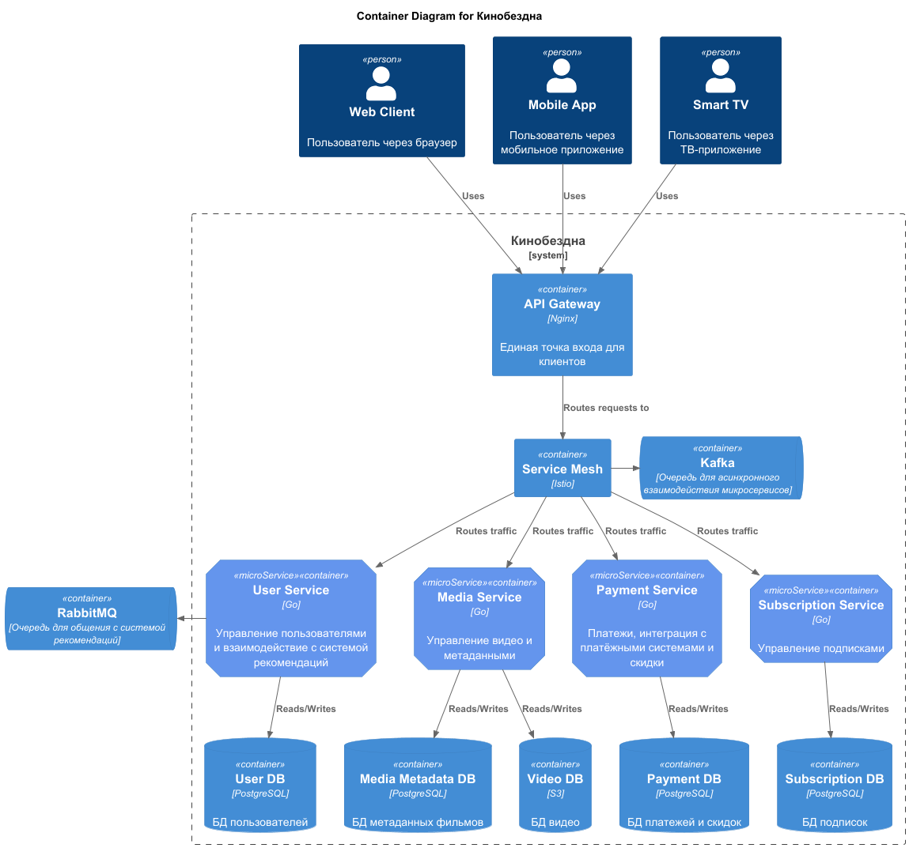
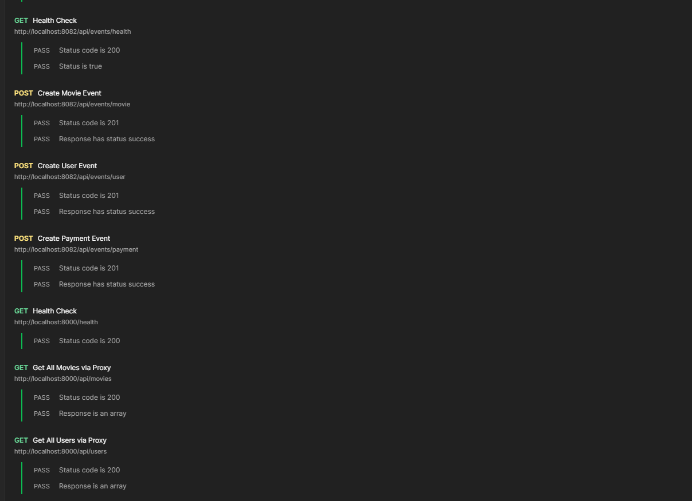
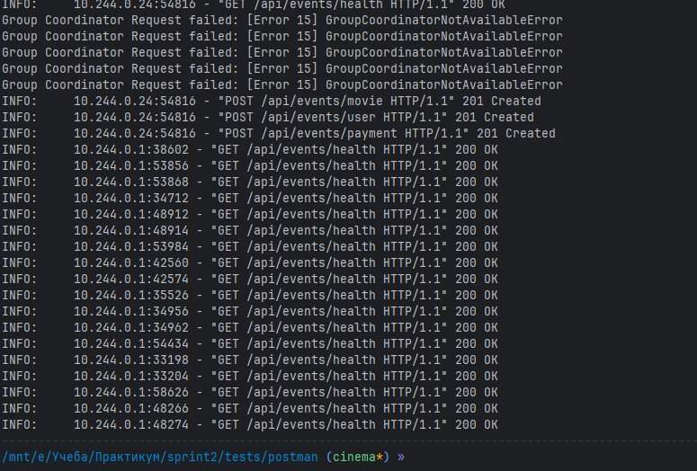
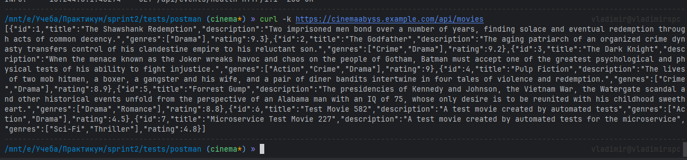

## Изучите [README.md](.\README.md) файл и структуру проекта.

# Задание 1

[ссылка на файл](./diagrams/container/cinema_container.puml)

# Задание 2

### 2.1. Proxy
[proxy service](/src/microservices/proxy/main.py)

### 2.2. Kafka




# Задание 3

Команда начала переезд в Kubernetes для лучшего масштабирования и повышения надежности. 
Вам, как архитектору осталось самое сложное:
 - реализовать CI/CD для сборки прокси сервиса
 - реализовать необходимые конфигурационные файлы для переключения трафика.


### CI/CD

 В папке .github/worflows доработайте деплой новых сервисов proxy и events в docker-build-push.yml , чтобы api-tests при сборке отрабатывали корректно при отправке коммита в ваш репозиторий.

Нужно доработать 
```yaml
on:
  push:
    branches: [ main ]
    paths:
      - 'src/**'
      - '.github/workflows/docker-build-push.yml'
  release:
    types: [published]
```
и добавить необходимые шаги в блок
```yaml
jobs:
  build-and-push:
    runs-on: ubuntu-latest
    permissions:
      contents: read
      packages: write

    steps:
      - name: Checkout repository
        uses: actions/checkout@v3

      - name: Set up Docker Buildx
        uses: docker/setup-buildx-action@v2

      - name: Log in to the Container registry
        uses: docker/login-action@v2
        with:
          registry: ${{ env.REGISTRY }}
          username: ${{ github.actor }}
          password: ${{ secrets.GITHUB_TOKEN }}

```
Как только сборка отработает и в github registry появятся ваши образы, можно переходить к блоку настройки Kubernetes
Успешным результатом данного шага является "зеленая" сборка и "зеленые" тесты


### Proxy в Kubernetes






# Задание 4
Для простоты дальнейшего обновления и развертывания вам как архитектуру необходимо так же реализовать helm-чарты для прокси-сервиса и проверить работу 

Для этого:
1. Перейдите в директорию helm и отредактируйте файл values.yaml

```yaml
# Proxy service configuration
proxyService:
  enabled: true
  image:
    repository: ghcr.io/db-exp/cinemaabysstest/proxy-service
    tag: latest
    pullPolicy: Always
  replicas: 1
  resources:
    limits:
      cpu: 300m
      memory: 256Mi
    requests:
      cpu: 100m
      memory: 128Mi
  service:
    port: 80
    targetPort: 8000
    type: ClusterIP
```

- Вместо ghcr.io/db-exp/cinemaabysstest/proxy-service напишите свой путь до образа для всех сервисов
- для imagePullSecret проставьте свое значение (скопируйте из конфигурации kubernetes)
  ```yaml
  imagePullSecrets:
      dockerconfigjson: ewoJImF1dGhzIjogewoJCSJnaGNyLmlvIjogewoJCQkiYXV0aCI6ICJaR0l0Wlhod09tZG9jRjl2UTJocVZIa3dhMWhKVDIxWmFVZHJOV2hRUW10aFVXbFZSbTVaTjJRMFNYUjRZMWM9IgoJCX0KCX0sCgkiY3JlZHNTdG9yZSI6ICJkZXNrdG9wIiwKCSJjdXJyZW50Q29udGV4dCI6ICJkZXNrdG9wLWxpbnV4IiwKCSJwbHVnaW5zIjogewoJCSIteC1jbGktaGludHMiOiB7CgkJCSJlbmFibGVkIjogInRydWUiCgkJfQoJfSwKCSJmZWF0dXJlcyI6IHsKCQkiaG9va3MiOiAidHJ1ZSIKCX0KfQ==
  ```

2. В папке ./templates/services заполните шаблоны для proxy-service.yaml и events-service.yaml (опирайтесь на свою kubernetes конфигурацию - смысл helm'а сделать шаблоны для быстрого обновления и установки)

```yaml
template:
    metadata:
      labels:
        app: proxy-service
    spec:
      containers:
       Тут ваша конфигурация
```

3. Проверьте установку
Сначала удалим установку руками

```bash
kubectl delete all --all -n cinemaabyss
kubectl delete  namespace cinemaabyss
```
Запустите 
```bash
helm install cinemaabyss .\src\kubernetes\helm --namespace cinemaabyss --create-namespace
```
Если в процессе будет ошибка
```code
[2025-04-08 21:43:38,780] ERROR Fatal error during KafkaServer startup. Prepare to shutdown (kafka.server.KafkaServer)
kafka.common.InconsistentClusterIdException: The Cluster ID OkOjGPrdRimp8nkFohYkCw doesn't match stored clusterId Some(sbkcoiSiQV2h_mQpwy05zQ) in meta.properties. The broker is trying to join the wrong cluster. Configured zookeeper.connect may be wrong.
```

Проверьте развертывание:
```bash
kubectl get pods -n cinemaabyss
minikube tunnel
```

Потом вызовите 
https://cinemaabyss.example.com/api/movies
и приложите скриншот развертывания helm и вывода https://cinemaabyss.example.com/api/movies

## Удаляем все

```bash
kubectl delete all --all -n cinemaabyss
kubectl delete namespace cinemaabyss
```
