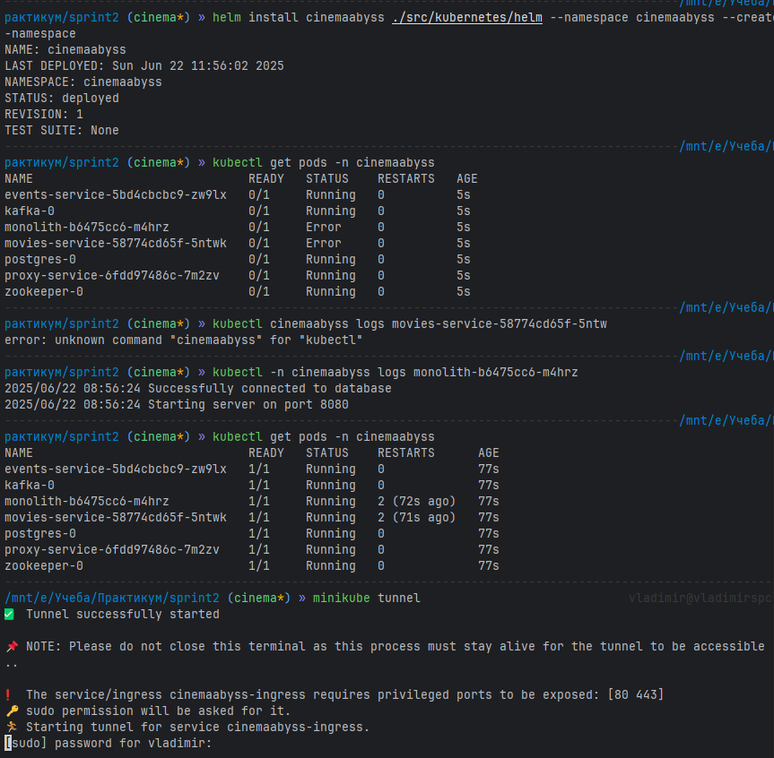
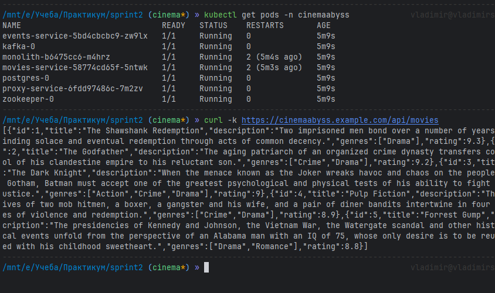

## Изучите [README.md](.\README.md) файл и структуру проекта.

# Задание 1

[ссылка на файл](./diagrams/container/cinema_container.puml)

# Задание 2

### 2.1. Proxy
[proxy service](/src/microservices/proxy/main.py)

### 2.2. Kafka


# Задание 3

Команда начала переезд в Kubernetes для лучшего масштабирования и повышения надежности. 
Вам, как архитектору осталось самое сложное:
 - реализовать CI/CD для сборки прокси сервиса
 - реализовать необходимые конфигурационные файлы для переключения трафика.


### CI/CD

 В папке .github/worflows доработайте деплой новых сервисов proxy и events в docker-build-push.yml , чтобы api-tests при сборке отрабатывали корректно при отправке коммита в ваш репозиторий.

Нужно доработать 
```yaml
on:
  push:
    branches: [ main ]
    paths:
      - 'src/**'
      - '.github/workflows/docker-build-push.yml'
  release:
    types: [published]
```
и добавить необходимые шаги в блок
```yaml
jobs:
  build-and-push:
    runs-on: ubuntu-latest
    permissions:
      contents: read
      packages: write

    steps:
      - name: Checkout repository
        uses: actions/checkout@v3

      - name: Set up Docker Buildx
        uses: docker/setup-buildx-action@v2

      - name: Log in to the Container registry
        uses: docker/login-action@v2
        with:
          registry: ${{ env.REGISTRY }}
          username: ${{ github.actor }}
          password: ${{ secrets.GITHUB_TOKEN }}

```
Как только сборка отработает и в github registry появятся ваши образы, можно переходить к блоку настройки Kubernetes
Успешным результатом данного шага является "зеленая" сборка и "зеленые" тесты


### Proxy в Kubernetes


# Задание 4




